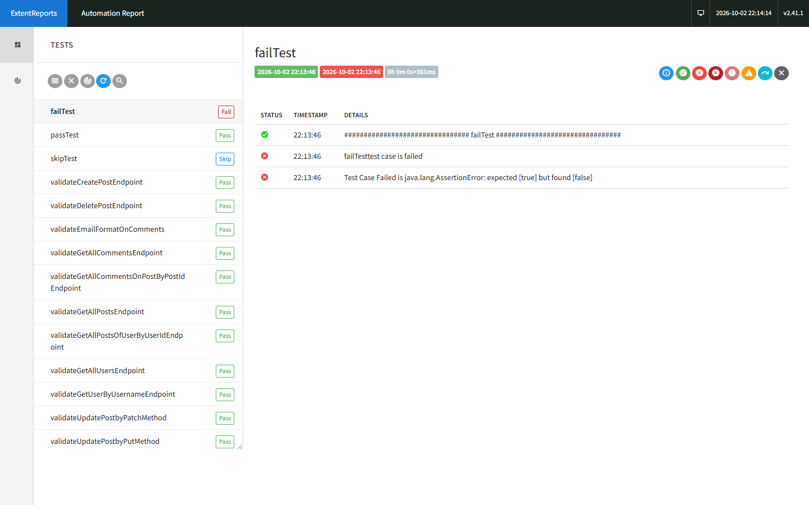
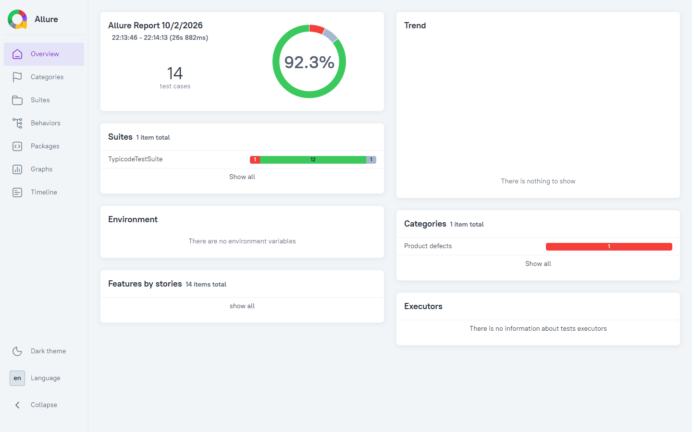

# api-automation-framework

A REST API test automation framework built with **Java**, **REST Assured** and **TestNG**, testing the public [JSONPlaceholder](https://jsonplaceholder.typicode.com) API.

This is the 2024 version of the framework. The refactored, up-to-date version lives in [api-automation](https://github.com/niranjankagri/api-automation).

## Tech stack

| | |
|---|---|
| Language | Java 1.8 |
| Build | Maven |
| HTTP client | REST Assured 4.0.0 |
| Test runner | TestNG 6.14.3 |
| JSON mapping | Jackson 2.9.8, org.json |
| Reports | ExtentReports 2, Allure (TestNG adapter), custom TestNG emailable report |
| Logging | log4j 1.2.17 |
| Test data | properties file, JavaFaker for random text |

## Project structure

```
api-automation-framework
├── pom.xml
├── testng.xml                         Suite "TypicodeTestSuite" + custom report listener
├── log4j.properties                   Console + applog.txt logging
└── src
    ├── main/java/com/typicode
    │   ├── builder        RequestBuilder (GET/POST/PUT/PATCH/DELETE), ResponseBuilder (status, body, JSON → objects)
    │   ├── constants      URL (base URL + endpoints), StatusCode
    │   ├── manager        Manager (entry point) + UserManager, PostManager, CommentManager
    │   ├── response       User, Post, Comment (POJOs)
    │   ├── testdata       BaseTest (Extent report setup), TestDataLoader
    │   ├── testng/report  TestListener (custom emailable HTML report)
    │   └── utils          PropertiesReader, JsonHelper, Util (logging, email regex, random words)
    ├── resources          data.properties, extent-config.xml, report template
    └── test/java/com/typicode/tests/TypicodeTest.java
```

## How it works

Tests never touch HTTP code directly. They call a **manager** for the resource they need:

```java
User user = Manager.getUserManager().getUserByUserName(getUsername());
List<Post> posts = Manager.getPostManager().getAllPostsOfUserByUserId(user.getId());
List<Comment> comments = Manager.getCommentManager().getAllCommentsOnPostsByPostId(posts);
```

Each manager builds the request with `RequestBuilder`, checks the status code, and maps the JSON response to POJOs with `ResponseBuilder`. Every request and status check is logged to the console, `applog.txt` and the Extent report.

## Tests

`TypicodeTest` contains 14 tests:

| Area | Tests |
|---|---|
| Users | get all users, get user by username |
| Posts | get all posts, get posts by user id, create (POST), update (PUT and PATCH), delete |
| Comments | get all comments, get comments by post id |
| Main scenario | `validateEmailFormatOnComments`: find the user by username → fetch their posts → fetch every comment on those posts → soft-assert that each email is valid |
| Report demo | `passTest`, `failTest`, `skipTest`: show the pass/fail/skip layouts in the reports (`failTest` always fails and `skipTest` always skips, on purpose) |

JSONPlaceholder fakes write operations: POST, PUT, PATCH and DELETE return realistic responses but nothing is stored.

## Running the tests

Requirements: Maven and a JDK that can compile Java 8 sources (tested with JDK 17).

Run from the project root (config files are read relative to the working directory):

```bash
mvn clean test
```

Test data lives in `src/resources/data.properties`:

```properties
username=Samantha
```

## Reports

| Report | Location |
|---|---|
| Extent report | `test-output/STMExtentReport.html` |
| Custom TestNG emailable report | `target/surefire-reports/custom-emailable-report.html` |
| TestNG default report | `target/surefire-reports/index.html` |
| Allure results | `allure-results/` (view with `allure serve allure-results`) |
| Log file | `applog.txt` |

### Extent report

Every test with its status, and each request, status check and result step by step.



### Allure report

Overview with the pass rate, suite results and defect categories.



The screenshots come from a full run: 12 tests passed, plus `failTest` and `skipTest`, which fail and skip on purpose to show those layouts.

## Adding a new endpoint

1. Add the path to `constants/URL`.
2. Add a POJO for the response in `response/`.
3. Add a manager in `manager/` that uses `RequestBuilder` and `ResponseBuilder`.
4. Expose it through a static getter in `Manager`.
5. Write the test in `TypicodeTest` (or a new class that extends `BaseTest`) and add it to `testng.xml`.
